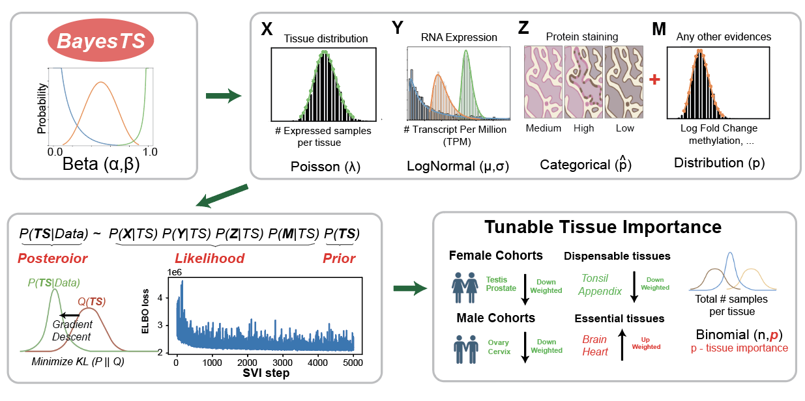

# BayesTS
Quantifying Tumor Specificity using Bayesian probabilistic modeling for drug target discovery and prioritization

 - Access BayesTS database for the tumor specifcity of 13,306 protein coding genes with both RNA and protein information [here](./database/full_results_XYZ.txt).

 - Access BayesTS database for the tumor specifcity of >100K melanoma splicing junctions consdiering both RNA and tissue distribution [here](./database/full_results_XY_splicing.txt).

 - Retrain the BayesTS model to adjust tissue importance see [here](https://github.com/frankligy/BayesTS#adjust-tissue-importance).


 # Overview

 

 # Use or extend the BayesTS

 ## Installation

I develop BayesTS in Linux System (to utilize gpu) with Python 3.7, but since the dependencies here are not complicated, I do not anticipate huge efforts for migrating it to other system.

I prefer using a conda environment and using prefix to install it to your current directory (you can modify the `-p`). `mamba` should be faster than `conda`.

 ```
# env
mamba env create -f pytorch_pyro_mamba_env_linux_37.yml -p ./BayesTS_env

# code
git clone https://github.com/frankligy/BayesTS.git
 ```

 ## Adjust tissue importance

 You first prepare a plain txt (demiliter is tab) file like this, the valid tissues can be found in [RNA_valid_tisse](./database/rna_valid_tissue.txt) and [protein_valid_tisse](./database/protein_tissue.txt). I didn't implement any magic function to convert the strings, so please go over these two list, and choose all tissues, tissue name can be different in RNA and protein, for example, Testis (RNA) and testis (protein), so just include all like below:

 ```
tissue     weight
tonsil      0.1
appendix    0.1
testis      0.1
Testis      0.1
 ```

You need to download RNA or Protein data from [this synapse folder](https://www.synapse.org/#!Synapse:syn51170082/files/).

 ```
# help information
python BayesTS.py --help

# trian using full model including protein
python BayesTS.py --input "./coding.h5ad"  # download gene count from synapse
                   --weight "./weights.txt"   # see above
                   --mode "XYZ"      # XYZ is full model, XY is RNA model
                   --protein "./normal_tissue.tsv"  # download from synapses

# train using RNA model if protein is not available
python BayesTS.py --input "./coding.h5ad"  # download gene count from synapse
                   --weight "./weights.txt"   # see above
                   --mode "XY"                   
 ```

All outputs will be saved in current directory

## Contact

Guangyuan(Frank) Li

Email: li2g2@mail.uc.edu

PhD student, Biomedical Informatics

Cincinnati Children’s Hospital Medical Center(CCHMC)

University of Cincinnati, College of Medicine

